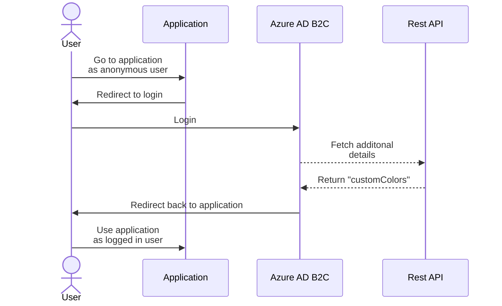

# Custom policy & Rest API example

## Official documentation links

https://learn.microsoft.com/en-us/azure/active-directory-b2c/custom-policy-overview

https://learn.microsoft.com/en-us/azure/active-directory-b2c/api-connectors-overview?pivots=b2c-custom-policy

https://learn.microsoft.com/en-us/azure/active-directory-b2c/tutorial-create-user-flows?pivots=b2c-custom-policy

https://learn.microsoft.com/en-us/azure/active-directory-b2c/add-api-connector-token-enrichment?pivots=b2c-custom-policy

## Scenario

You want to call Rest API from your custom policy to add additional claims to the token.

Here is the sequence diagram of the scenario:



Rest API will return `customColors` string array.

Add new claim type to define this type:

```xml
<ClaimType Id="customColors">
  <DisplayName>Favorite colors</DisplayName>
  <DataType>stringCollection</DataType>
  <UserHelpText>Favorite colors.</UserHelpText>
</ClaimType>
```

Add Rest API configuration as technical profile but in this demo it's anonymous and **without required authentication settings**:

```xml
<TechnicalProfile Id="REST-LocalClaimExtender">
  <DisplayName>Use demo app for adding extra claim</DisplayName>
  <Protocol Name="Proprietary" Handler="Web.TPEngine.Providers.RestfulProvider, Web.TPEngine, Version=1.0.0.0, Culture=neutral, PublicKeyToken=null" />
  <Metadata>
    <Item Key="ServiceUrl">https://blbpcnjx-5001.euw.devtunnels.ms/api/ClaimExtender</Item>
    <Item Key="AuthenticationType">None</Item>
    <Item Key="AllowInsecureAuthInProduction">true</Item>
    <Item Key="SendClaimsIn">Body</Item>
    <Item Key="DefaultUserMessageIfRequestFailed">Cannot process your super important validation request right now, please try again later.</Item>
  </Metadata>
  <InputClaims>
    <InputClaim ClaimTypeReferenceId="userPrincipalName" />
    <InputClaim ClaimTypeReferenceId="objectId" />
    <InputClaim ClaimTypeReferenceId="givenName" />
    <InputClaim ClaimTypeReferenceId="surName" />
  </InputClaims>
  <OutputClaims>
    <OutputClaim ClaimTypeReferenceId="customColors" />
  </OutputClaims>
  <UseTechnicalProfileForSessionManagement ReferenceId="SM-Noop" />
</TechnicalProfile>
```

Note: Above `ServiceUrl` is using VS Dev Tunnel for demonstration purposes.

Add orchestration step to your user journey to call this Rest API in the sign-in:

```xml
<OrchestrationStep Order="4" Type="ClaimsExchange">
  <ClaimsExchanges>
    <ClaimsExchange Id="RESTLocalClaimExtender" TechnicalProfileReferenceId="REST-LocalClaimExtender" />
  </ClaimsExchanges>
</OrchestrationStep>
```

Add output claim to your relaying party to return it to the application:

```xml
<OutputClaim ClaimTypeReferenceId="customColors" />
```

Above input claim definition in the Rest API application means that your app will get following payload:

```json
{
  "userPrincipalName": "5e5a77ac-6a6a-4ed7-8df2-e2792f1da401@<yourtenantname>.onmicrosoft.com",
  "objectId": "5e5a77ac-6a6a-4ed7-8df2-e2792f1da401",
  "givenName": "John",
  "surName": "Smith"
}
```

Let's implement Rest API which returns following static response:

```json
{
 "customColors": [ "red", "green", "blue" ]
}
```

You can now test this in your Azure AD B2C:


Sign in using local account:


Breakpoint in Visual Studio shows the incoming claims:


Target application has received the token with the new `customColors` claim:


## Error scenarios

[Handling error messages](https://learn.microsoft.com/en-us/azure/active-directory-b2c/api-connectors-overview?pivots=b2c-custom-policy#handling-error-messages)

From that document:

> ... calling a REST API technical profile from a **validation technical profile**. 
> **Letting the user to correct the data on the page and run the validation again** upon page submission.

> If you reference a REST API technical profile directly from a **user journey**, 
> the user is **redirected back to the relying party application with the relevant error message**.

`AADB2C90075: Cannot process your super important validation request right now, please try again later.`


In more generic connection error case you might see following error message:


